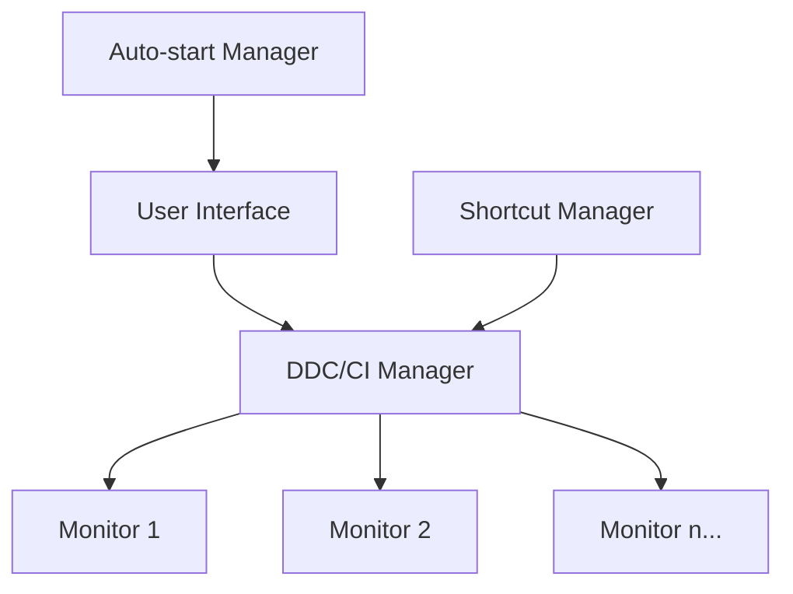
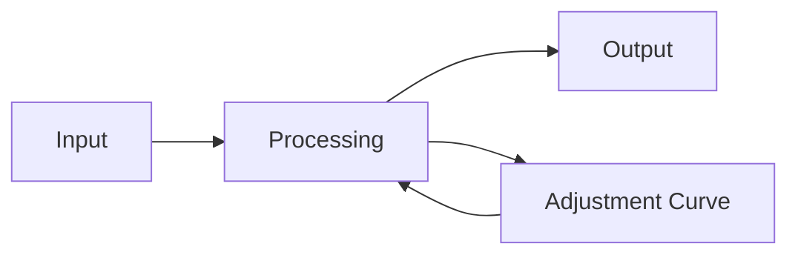

# DDC/CI Screen Controller

A desktop application to control monitor brightness and settings via the DDC/CI protocol. 

[中文文档](README_ZH.md) | English

## Features

- Controls screen brightness via DDC/CI protocol
- Supports shortcut key control
- Auto-start capability 
- Multi-monitor support
- User-friendly interface

## Star History

## Architecture

## Brightness Response Curve

## Development

This application is developed using:
- C++ for core functionality
- Qt framework for the user interface
- Modern C++ standards

## Getting Started

[Installation and usage instructions will go here]

## License

MIT License

---

*Made for desktop computers, controls screen brightness via DDC/CI protocol, supports shortcut key control and auto-start*
