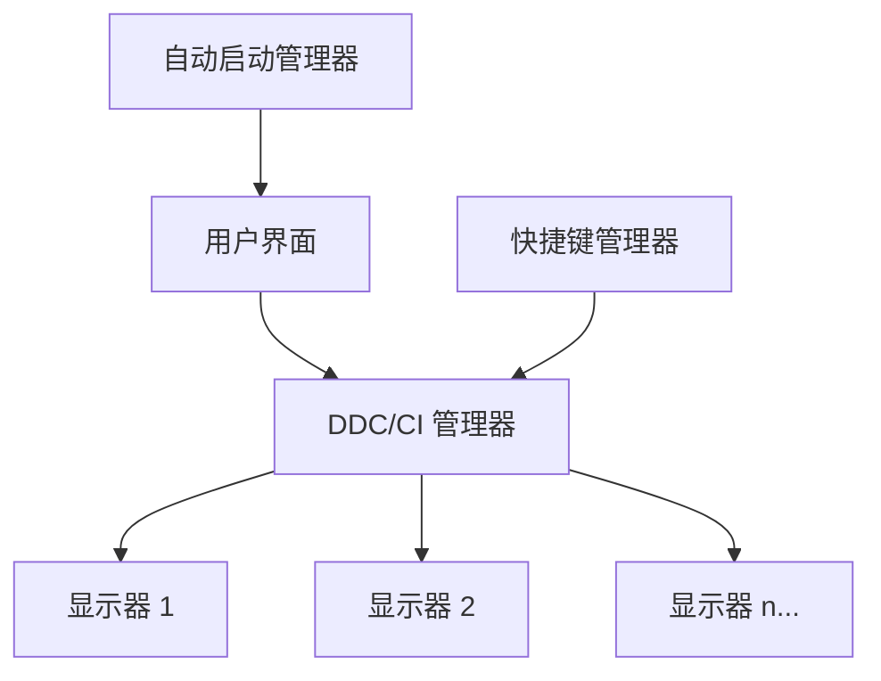
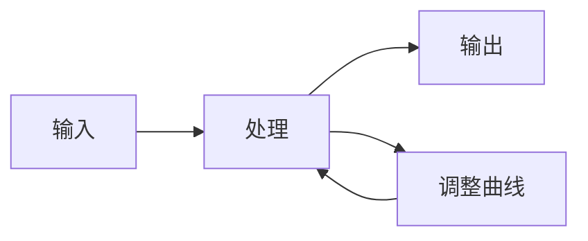

# DDC/CI 屏幕控制器

一款通过DDC/CI协议控制显示器亮度和设置的桌面应用程序。

中文 | [English](README.md)

## 功能特点

- 通过DDC/CI协议控制屏幕亮度
- 支持快捷键控制
- 自动启动功能
- 多显示器支持
- 用户友好的界面

## 星标历史

## 架构

## 亮度响应曲线

## 开发信息

本应用程序使用以下技术开发：
- C++用于核心功能
- Qt框架用于用户界面
- 现代C++标准

## 开始使用

[这里将提供安装和使用说明]

## 许可证

MIT 许可证

---

*专为桌面电脑设计，通过DDC/CI协议控制屏幕亮度，支持快捷键控制和自动启动* 